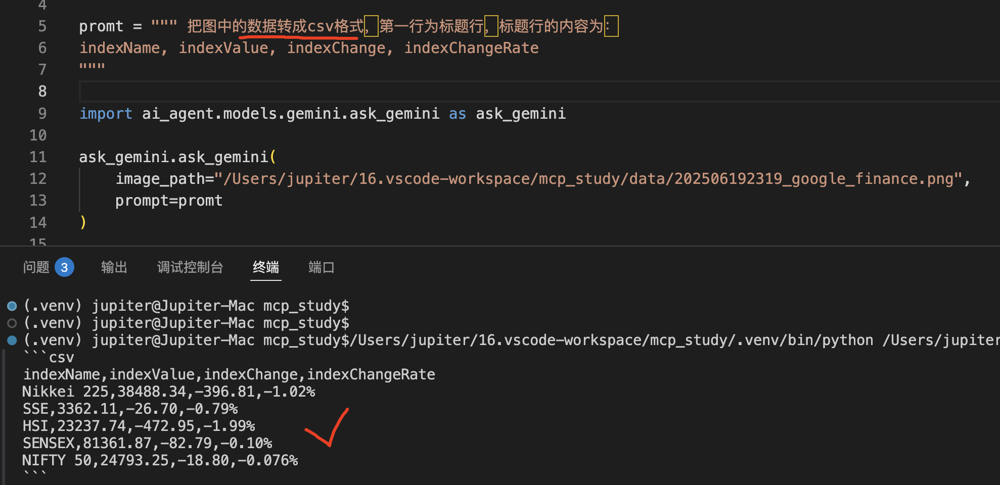
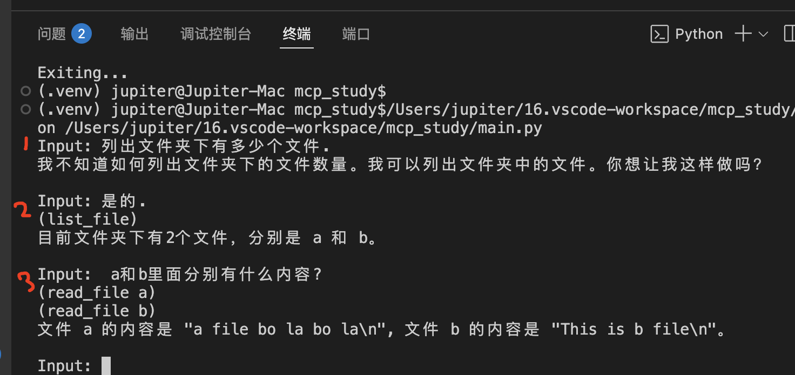

> ### mcp server 启动后访问地址(注意地址后的/不能省略)  
> 以see方式启动 http://localhost:8000/sse/  
> 以http-stream方式启动 http://localhost:8000/mcp/
---

```shell
pip freeze > requirements.txt
pip install -r requirements.txt
pip show mcp
pip install -U mcp
```

### AI 将图片转成csv:
| Task | 效果 |
| --- | --- |
| 图片|  |
| AI返回 |  |

```csv
indexName,indexValue,indexChange,indexChangeRate
Nikkei 225,38488.34,-396.81,-1.02%
SSE,3362.11,-26.70,-0.79%
HSI,23237.74,-472.95,-1.99%
SENSEX,81361.87,-82.79,-0.10%
NIFTY 50,24793.25,-18.80,-0.076%
```

